# 🏗️ Master Architecture: AI-Native Education Ecosystem

> **Version:** 2.0 &nbsp;|&nbsp; **Last Updated:** February 15, 2026  
> **Status:** Living Document — Evolves with each deployment phase

A unified technical and pedagogical blueprint for a **modular, data-driven learning platform** that integrates **MCP (Model Context Protocol)**, **Gemini 3 Pro** reasoning, and a **Mastery-based evaluation framework** to deliver deeply personalized education at scale across India.

---

## Table of Contents

1. [System Philosophy](#1-system-philosophy)
2. [High-Level System Overview](#2-high-level-system-overview)
3. [Technical Architecture — The MCP-Native Core](#3-technical-architecture--the-mcp-native-core)
4. [The "AI Factory" — Course Development Pipeline](#4-the-ai-factory--course-development-pipeline)
5. [Mastery Tree & Knowledge Graph](#5-mastery-tree--knowledge-graph)
6. [Evaluation & Testing Strategy](#6-evaluation--testing-strategy)
7. [Classroom Integration — Physical-Digital Bridge](#7-classroom-integration--physical-digital-bridge)
8. [Security, Privacy & Compliance](#8-security-privacy--compliance)
9. [Scalability & Infrastructure](#9-scalability--infrastructure)
10. [Deployment Roadmap](#10-deployment-roadmap)
11. [Key Design Decisions & Trade-offs](#11-key-design-decisions--trade-offs)
12. [Glossary](#12-glossary)

---

## 1. System Philosophy

The platform is built on four foundational pillars:

| Pillar | Principle | Implication |
|--------|-----------|-------------|
| **Schema-Driven** | Logic is defined by data structures and tool schemas, not hard-coded paths | New capabilities are added by registering new MCP tools — zero redeployment of the core |
| **Agentic Orchestration** | AI agents discover capabilities (tools) via MCP to fulfill student needs dynamically | The system self-assembles its workflow per student request |
| **Mastery-First** | Proficiency is measured through conceptual depth and transferability, not just completion | A student "passes" only when they can apply knowledge to novel, unseen contexts |
| **Equity by Design** | Every architectural choice accounts for low-bandwidth, multilingual, offline-first environments | India's Tier-2/3 cities and rural schools are first-class deployment targets |

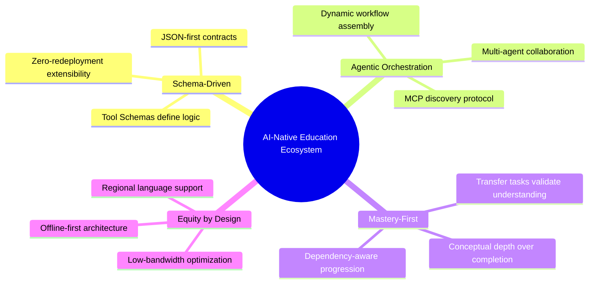

---

## 2. High-Level System Overview

The following diagram captures the end-to-end flow from student interaction through AI processing to classroom feedback.

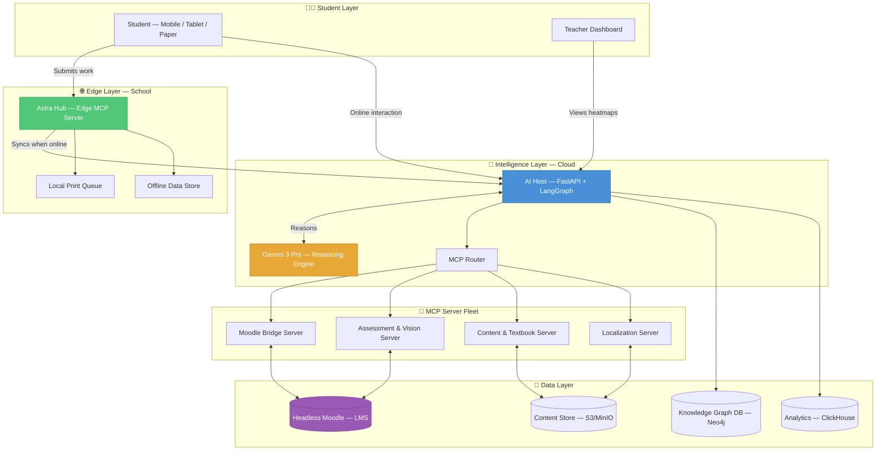

---

## 3. Technical Architecture — The MCP-Native Core

### 3A. The "Nervous System" — Orchestration Layer

The orchestration layer is the brain of the platform. It routes student needs to the right tools without any hard-coded logic.

| Component | Technology | Role |
|-----------|------------|------|
| **AI Host** | FastAPI + LangGraph | Central reasoning node — receives requests, plans multi-step actions, calls MCP tools |
| **Reasoning Engine** | Gemini 3 Pro | Provides deep pedagogical reasoning, content analysis, and evaluation |
| **MCP Protocol** | JSON-RPC 2.0 over stdio/SSE | Replaces traditional REST APIs — the Host *discovers* tool capabilities at runtime |
| **LMS Backend** | Headless Moodle | The "State of Truth" — single source for enrollment, grades, progress |
| **Knowledge Graph** | Neo4j | Stores the Mastery Tree, concept dependencies, and student traversal paths |
| **Analytics Engine** | ClickHouse | Real-time aggregation of engagement metrics, time-to-mastery, and cohort comparisons |

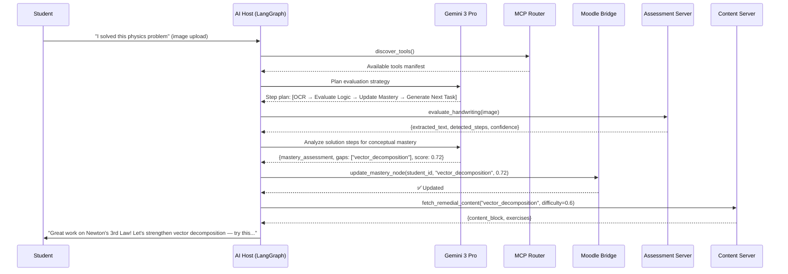

### 3B. Modular MCP Server Fleet

Each MCP server is an independently deployable microservice exposing tools via the MCP protocol.

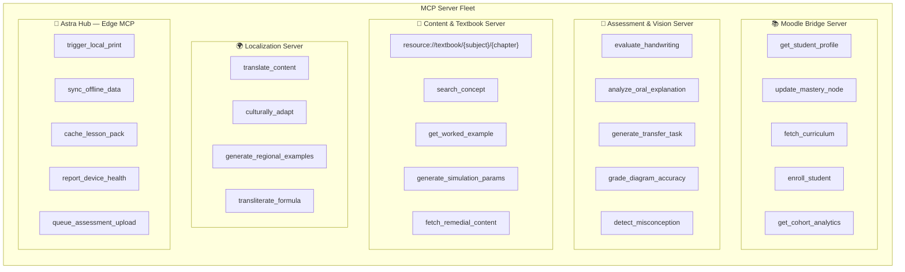

#### MCP Tool Schema Example

Every tool is defined by a strict JSON schema contract. This is what the AI Host sees when it discovers the Assessment Server:

```json
{
  "name": "evaluate_handwriting",
  "description": "OCR + logical analysis of a student's handwritten solution",
  "inputSchema": {
    "type": "object",
    "properties": {
      "image_base64": { "type": "string", "description": "Base64-encoded image of handwritten work" },
      "subject": { "type": "string", "enum": ["math", "physics", "chemistry", "biology"] },
      "expected_topic": { "type": "string", "description": "The concept the student was working on" },
      "student_id": { "type": "string" },
      "grading_rubric": {
        "type": "object",
        "properties": {
          "check_units": { "type": "boolean", "default": true },
          "check_diagram": { "type": "boolean", "default": false },
          "partial_credit": { "type": "boolean", "default": true }
        }
      }
    },
    "required": ["image_base64", "subject", "expected_topic", "student_id"]
  }
}
```

### 3C. Data Flow Architecture

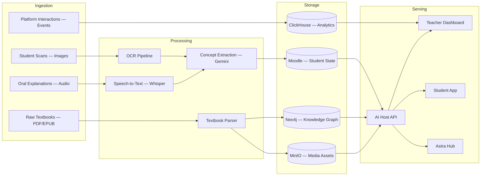

---

## 4. The "AI Factory" — Course Development Pipeline

The system scales content creation using an agentic pipeline that transforms raw textbooks into interactive, mastery-aligned learning journeys.

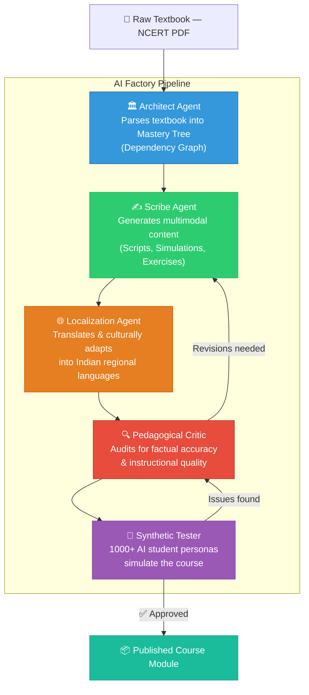

### Agent Specifications

| Agent | Input | Output | Key Capabilities |
|-------|-------|--------|-------------------|
| **Architect** | Raw textbook PDF/EPUB | Mastery Tree JSON (DAG) | Chapter segmentation, concept extraction, prerequisite mapping, Bloom's taxonomy tagging |
| **Scribe** | Mastery Tree + Concept Nodes | Multimodal content packages | Video scripts, interactive simulations (PhET-style), scaffolded exercises, worked examples |
| **Localization** | English content packages | Regionalized content | Translation (Hindi, Tamil, Telugu, Bengali, Marathi, etc.), culturally relevant examples, local unit conversions |
| **Pedagogical Critic** | Generated content | Audit reports + revision directives | Factual verification against source textbook, cognitive load analysis, prerequisite alignment check |
| **Synthetic Tester** | Published course draft | Test reports + edge cases | Simulates 1000+ student personas across skill spectrums, detects hallucinations, dead-ends, unfair difficulty spikes |

### Content Generation Workflow — Detailed

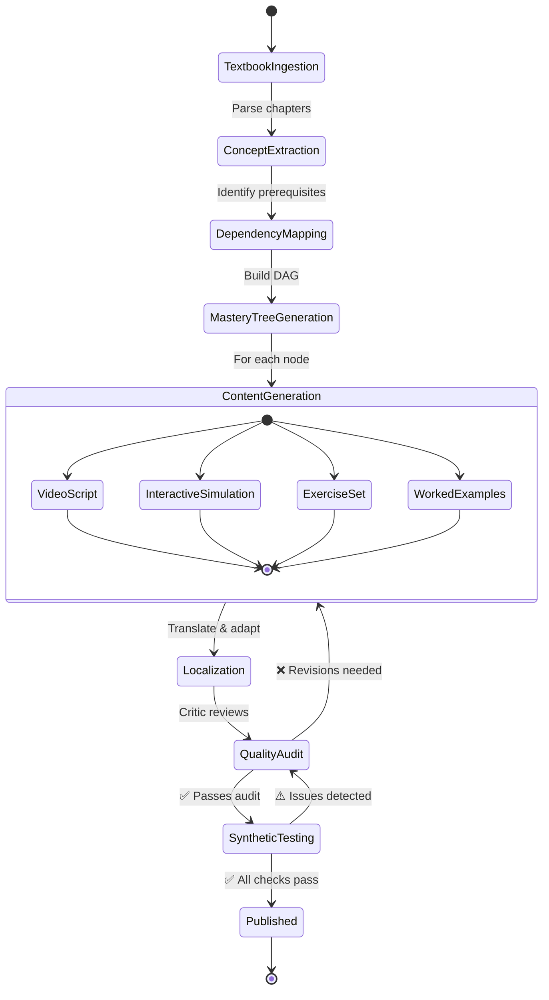

---

## 5. Mastery Tree & Knowledge Graph

The Mastery Tree is the structural backbone of personalized learning. It models **what** a student knows and **what they need next**.

### Concept Dependency Graph — Example (Physics: Mechanics)

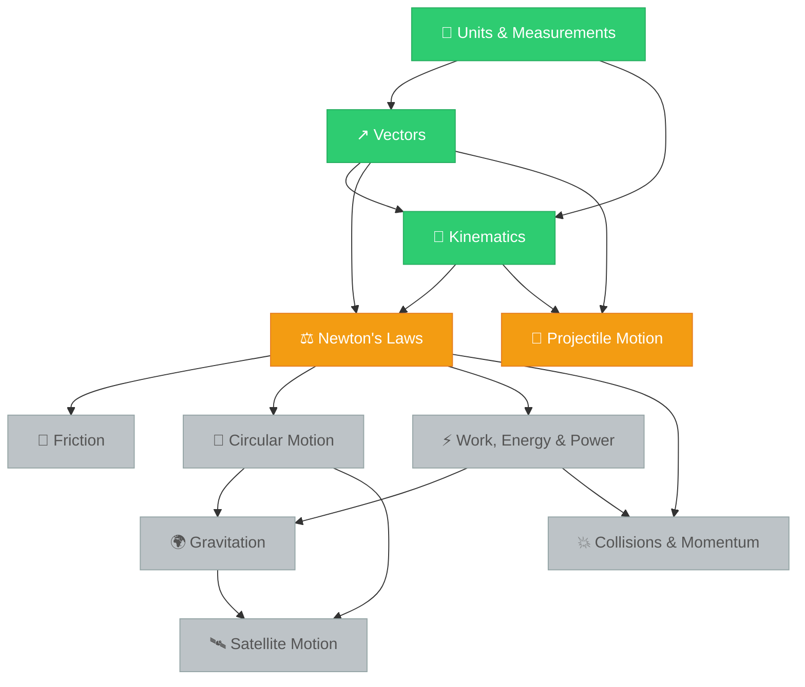

### Student State Model (per Mastery Node)

```json
{
  "student_id": "STU-2026-04521",
  "concept_id": "physics.mechanics.newtons_laws",
  "mastery_level": 0.72,
  "bloom_level": "application",
  "attempts": 5,
  "last_assessment": "2026-02-14T10:30:00Z",
  "misconceptions_detected": ["action_reaction_same_body", "force_implies_motion"],
  "transfer_tasks_passed": 1,
  "transfer_tasks_total": 3,
  "recommended_next": ["friction", "circular_motion"],
  "time_spent_minutes": 145
}
```

### Knowledge Graph Schema

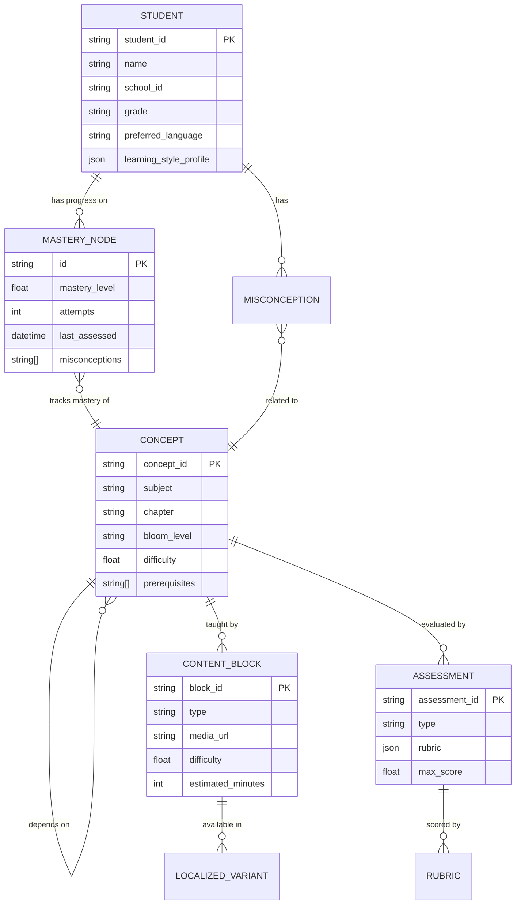

---

## 6. Evaluation & Testing Strategy

### I. Student "Deep Understanding" Evaluation

Traditional MCQ-based testing is insufficient. This platform evaluates **conceptual depth** across three dimensions:

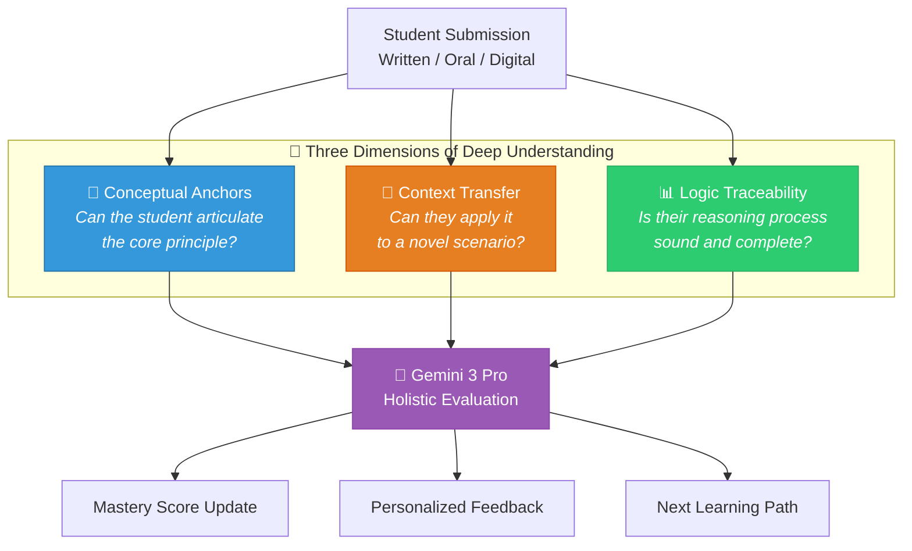

| Dimension | Method | Example |
|-----------|--------|---------|
| **Conceptual Anchors** | Gemini analyzes oral/written input for core principles, not keywords | Student explains *why* a ball slows down, not just "friction" |
| **Context Transfer** | Apply concepts to novel, real-world scenarios | "How does Newton's 3rd Law apply in a cricket bat hitting a ball?" |
| **Logic Traceability** | Grading focuses on process steps, identifying sub-concept gaps | In a multi-step math problem, pinpoints *where* the reasoning breaks |

### II. Platform Meta-Testing

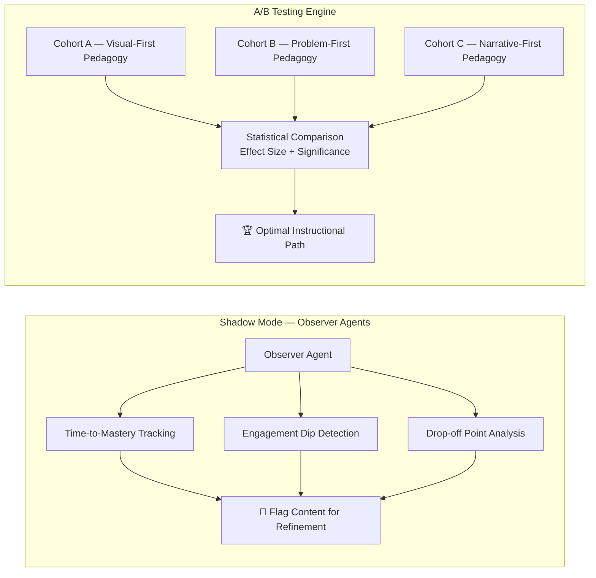

### III. System Reliability — Synthetic Testing

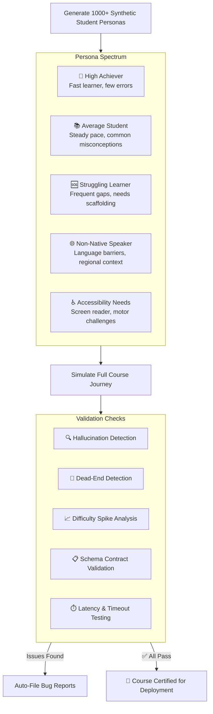

---

## 7. Classroom Integration — Physical-Digital Bridge

The platform bridges the physical classroom and digital systems seamlessly.

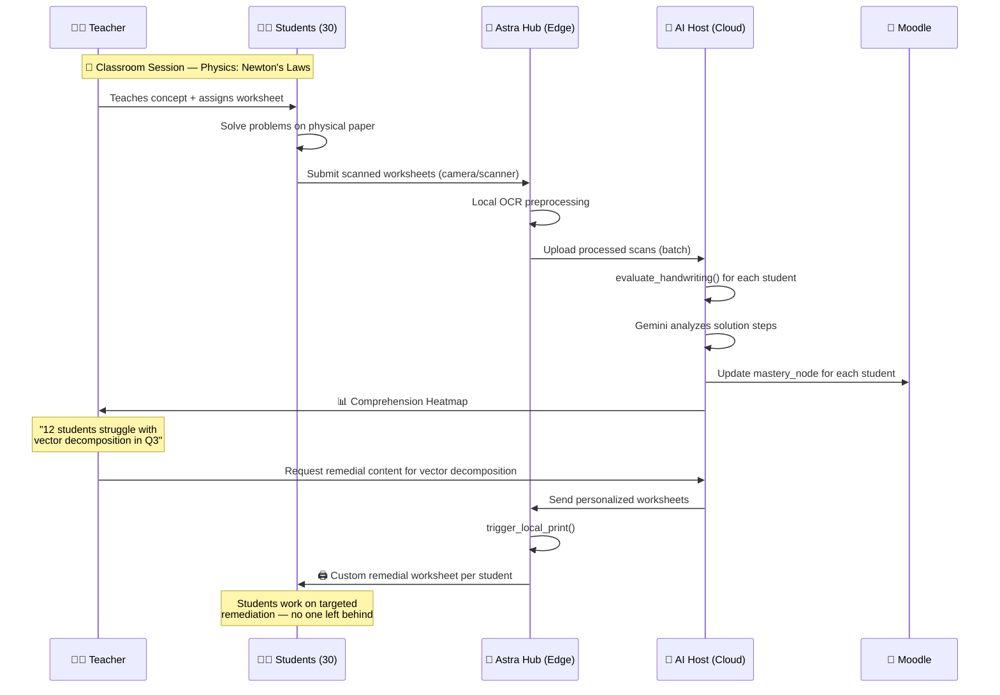

### Comprehension Heatmap — Teacher View

| Concept | Class Avg | Below Threshold | Action |
|---------|-----------|-----------------|--------|
| Newton's 1st Law | 0.85 ✅ | 3 students | Individual follow-up |
| Newton's 2nd Law (F=ma) | 0.78 ⚠️ | 7 students | Small group session |
| Vector Decomposition | 0.52 🔴 | 12 students | Full class re-teach + remedial prints |
| Free Body Diagrams | 0.68 ⚠️ | 9 students | Interactive simulation assignment |

### Offline-First Architecture — Astra Hub

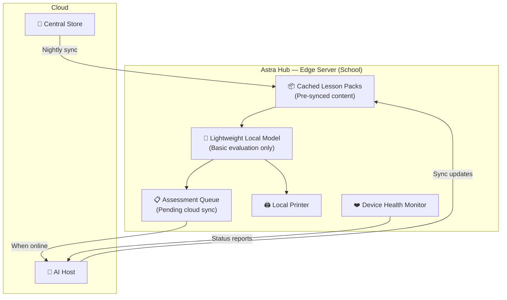

---

## 8. Security, Privacy & Compliance

### Data Protection Framework

| Layer | Measure | Details |
|-------|---------|---------|
| **Student Data** | End-to-end encryption | AES-256 at rest, TLS 1.3 in transit |
| **PII Handling** | DPDPA 2023 compliant | India's Digital Personal Data Protection Act — consent-based data collection |
| **Biometric Data** | Minimization principle | Handwriting/voice processed for evaluation only; raw data purged after analysis |
| **Access Control** | RBAC + ABAC | Role-based (teacher, student, admin) + Attribute-based (school, grade, region) |
| **Audit Trail** | Immutable logs | Every AI decision logged with reasoning chain for explainability |
| **Edge Security** | Hardware attestation | Astra Hubs use TPM-based device identity |

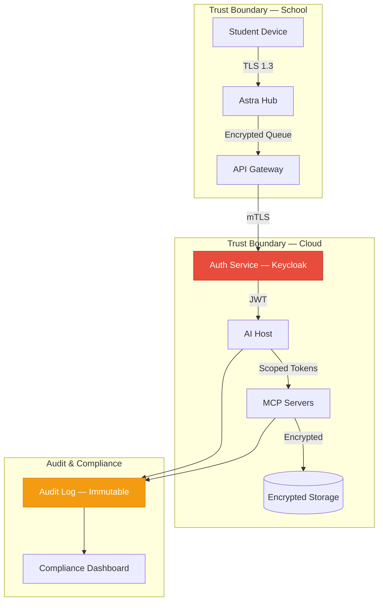

---

## 9. Scalability & Infrastructure

### Deployment Topology

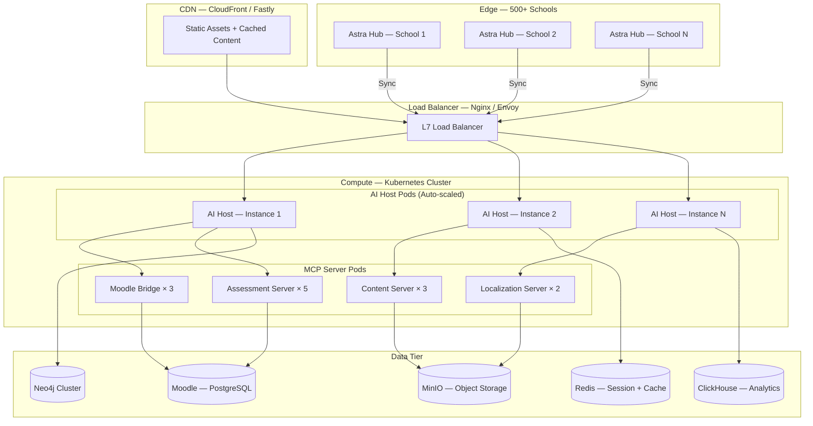

### Performance Targets

| Metric | Target | Measurement |
|--------|--------|-------------|
| **API Latency (p95)** | < 200ms | AI Host response to MCP tool call |
| **Evaluation Turnaround** | < 30 seconds | From scan upload to mastery update |
| **Concurrent Students** | 50,000+ | Per region, auto-scaled |
| **Offline Autonomy** | 72 hours | Astra Hub operates without cloud connectivity |
| **Sync Recovery** | < 5 minutes | Full state sync after connectivity restored |
| **Content Generation** | 1 chapter/hour | AI Factory pipeline throughput |

---

## 10. Deployment Roadmap

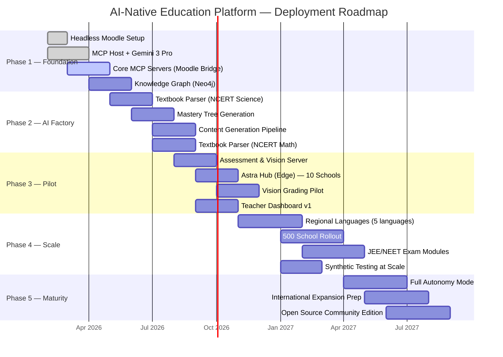

### Phase Details

| Phase | Focus | Key Deliverables | Success Criteria |
|-------|-------|------------------|------------------|
| **Phase 1** | Foundation | Headless Moodle, MCP Host, Gemini integration, Neo4j | AI Host can discover and call MCP tools; student data flows end-to-end |
| **Phase 2** | AI Factory | NCERT Science & Math ingested into Mastery Trees | 100+ concept nodes with dependencies; content generated for each |
| **Phase 3** | Pilot | Vision grading, Astra Hub in 10 schools, Teacher Dashboard | 500+ students evaluated via scan; teachers report actionable heatmaps |
| **Phase 4** | Scale | 5 regional languages, 500 schools, JEE/NEET modules | <30s evaluation turnaround at scale; exam-readiness metrics correlate with results |
| **Phase 5** | Maturity | Full autonomy, international prep, open-source edition | Platform self-improves via shadow mode; community contributions active |

---

## 11. Key Design Decisions & Trade-offs

| Decision | Chosen Approach | Alternative Considered | Rationale |
|----------|-----------------|----------------------|-----------|
| **Protocol** | MCP (Model Context Protocol) | REST + GraphQL | MCP enables runtime tool discovery — agents self-assemble workflows without code changes |
| **LMS** | Headless Moodle | Custom LMS | Moodle is proven at scale in Indian education; headless mode gives us API control |
| **AI Model** | Gemini 3 Pro | GPT-4, Claude, Llama | Superior multimodal reasoning (handwriting + diagrams), cost-effective at scale |
| **Graph DB** | Neo4j | PostgreSQL + recursive CTEs | Native graph traversal for prerequisite chains; performs 10x better for path queries |
| **Edge Computing** | Astra Hub (custom) | Chromebooks + Cloud-only | India's connectivity reality demands offline-first; custom hub controls the full UX |
| **Content Format** | JSON-first structured | Markdown / HTML | JSON enables programmatic manipulation by AI agents; rendered to any frontend |
| **Analytics** | ClickHouse | PostgreSQL / TimescaleDB | Column-oriented storage is ideal for aggregation-heavy analytics queries |

---

## 12. Glossary

| Term | Definition |
|------|------------|
| **MCP** | Model Context Protocol — an open standard for AI agents to discover and invoke tools |
| **Mastery Tree** | A directed acyclic graph (DAG) of concepts where edges represent prerequisite dependencies |
| **Mastery Node** | A student's proficiency record for a single concept, including score, misconceptions, and history |
| **Transfer Task** | An assessment that requires applying a concept to an unfamiliar, real-world context |
| **Astra Hub** | A low-cost edge server deployed in schools for offline-first operation and local printing |
| **Bloom's Level** | Bloom's Taxonomy classification (Remember → Understand → Apply → Analyze → Evaluate → Create) |
| **Comprehension Heatmap** | Real-time visualization of class-wide understanding levels per concept |
| **Shadow Mode** | Background observer agents that track learning metrics without affecting the student experience |
| **AI Factory** | The multi-agent pipeline that converts raw textbooks into interactive, mastery-aligned courses |
| **Synthetic Student** | An AI-simulated learner persona used for automated course quality testing |
| **DPDPA** | Digital Personal Data Protection Act, 2023 — India's data privacy legislation |

---

<div align="center">

**Built with ❤️ for every student in India**

*Because understanding should never be a privilege — it should be a pathway.*

</div>
